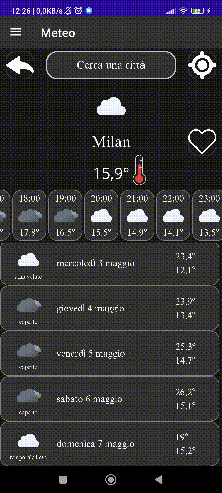

# Weather Forecast App MAUI

### [How to Download the App](https://github.com/GiorgioCitterio/WeatherForecastAppMAUI/wiki)

<a href="https://github.com/GiorgioCitterio/WeatherForecastAppMAUI/blob/master/README.it.md">README.it 🇮🇹</a>

---
</img>

</img>

</img>

</img>

---

### Features
- Set a default location to display the weather forecast upon app launch.
- Display the current location using GPS upon app launch.
- Search for weather forecasts of any city.
- Light/dark theme based on system settings.
- View the bar chart of daily temperatures.
- Add cities to favorites and view their forecasts.

### Platforms:
- Android

---
### .NET MAUI Version:
- The project was developed using [.NET MAUI 7](https://learn.microsoft.com/en-us/dotnet/maui/whats-new/dotnet-7?view=net-maui-7.0).

---
### Nuget Packages:
- **CommunityToolkit.Mvvm**: Microsoft library used to facilitate MVVM usage.
- **sqlite-net-pc**: SQLite-net library used for SQLite database.
- **SQLitePCLRaw.bundle_green**: Eric Sink library used for SQLite database.
- **Syncfusion.Maui.Charts**: Syncfusion library used to create the bar chart of daily temperatures.
